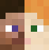

# CB-Heads

 CB-Heads is a feature-rich plugin for getting and placing playerheads on PocketMine-MP servers.
 The .phar can be found <a href="https://poggit.pmmp.io/p/CB-Heads">on poggit</a>.

# Commands
| Command | Description                    | Usage                  | Aliases    | Permission            |
|---------|--------------------------------|------------------------|------------|-----------------------|
| head    | Gives you the head of a player | /head <player: target> | playerhead | cb-heads.command.head |

**All commands can be configured in the config file.**

# Permissions
| Permission                           | Description                                                                     | Default |
|--------------------------------------|---------------------------------------------------------------------------------|---------|
| cb-heads.command.head                | Permission for the /head command                                                | op      |
| cb-heads.bypass.waiting              | Permission to bypass the head claim cooldown                                    | op      |
| cb-heads.bypass.blacklist            | Permission to get heads from players on the blacklist                           | false   |
| cb-heads.bypass.blacklist.playername | Permission to get heads from the given player even if they are on the blacklist | false   |

## Cooldowns
You can create multiple head claim cooldowns for different permissions in the config.
 These permissions will then look like this: `cb-heads.waiting.group`

# License
CB-Heads is licensed under the GNU General Public License v3.0.
 Further information: https://choosealicense.com/licenses/gpl-3.0
 <code>© 2019 - 2023 Wertzui123</code>

# Credits
This plugin is based on PlayerHead by Enes5519, which has been improved by wolfgamer2805.
 CB-Heads only contains little of the original sourcecode though, and I (Wertzui123) have implemented most of the features.
 The icon is composed of the skins "Steve" and "Alex" from Minecraft.